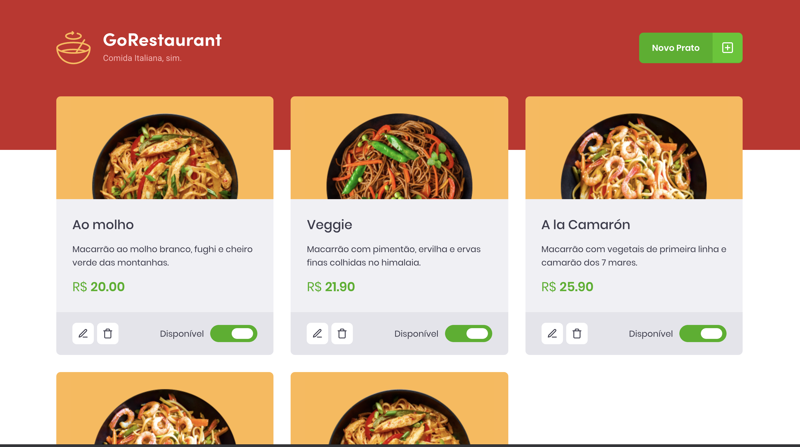

<h1 align="center">
    
</h1>

  

  

  

  

  

  <a href="#rocket-technologies">Technologie used</a>&nbsp;&nbsp;&nbsp;|&nbsp;&nbsp;&nbsp;
  <a href="#-project">Project</a>&nbsp;&nbsp;&nbsp;|&nbsp;&nbsp;&nbsp;
  <a href="#-layout">Layout</a>&nbsp;&nbsp;&nbsp;|&nbsp;&nbsp;&nbsp;
  <a href="#-how-can-i-run-it">How can I run it?</a>&nbsp;&nbsp;&nbsp;|&nbsp;&nbsp;&nbsp;
  <a href="#-how-can-i-help">How can I help?</a>&nbsp;&nbsp;&nbsp;|&nbsp;&nbsp;&nbsp;
  <a href="#memo-license">License</a>

 

  
  

## :rocket: Technologies

This project uses these technologies:

- [React](https://reactjs.org)

- [Json Server](https://github.com/typicode/json-server)

## 💻 Project

Soon...

## 🔖 Layout

<!-- You can download the layout (`.sketch`) using [this link](.github/DevRadar.sketch).

To open it in any SO, use [Figma](https://figma.com). -->

## 👨‍💻 How can I run it?

Soon...

## 🤔 How can I help?

- Fork this repository;
- Create a branch with your feature: `git checkout -b minha-feature`;
- Commit your changes: `git commit -m 'feat: Minha nova feature :tada:'`;
- Push it to your branch: `git push origin minha-feature`.

After merging your pull request, your branch can be deleted;

## :memo: License

This project uses the MIT license. Read [LICENSE](LICENSE.md) for details.

---

Made with ♥ by Vinícius Albuquerque :wave:
